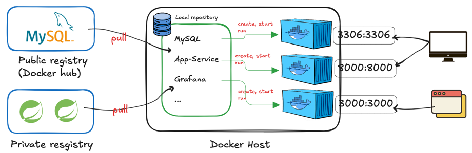

## Docker

### Docker

어플리케이션을 패키징 할 수 있는 툴, 하나의 컨테이너에 시스템 툴, 환경설정, 어플리케이션 등을 하나로 묶어서 다른 서버나 PC에 배포하여 안정적으로 운영할 수 있는 툴이다.  

### 가상화

물리적인 컴퓨터 리소스를 다른 시스템이나 어플리케이션에서 사용할 수 있도록 제공

### 방식

type1 : Native of Bare-metal, 하드웨어에서 직접적으로 하이퍼바이저를 설치하여 가상화하는 방법
type2 : Hosted : 운영체제 설치 후 하이퍼바이저 기능을 할 수 있는 기능을 설치 후 사용하는 방법(Linux, 운영체제 등등)

### 하이퍼바이저 

하나의 물리적 서버 호스트에서 여러 개의 서버 운영 체제를 게스트로 실행할 수 있게 해주는 소프트웨어 아키텍처이다.  
이러한 서버 가상화를 구현해주는 기술을 '**하이퍼바이저**'라고 한다.  
  
### 운영체제 가상화

여러 개의 운영체제를 하나의 호스트 OS에 생성해서 사용할 수 있게 하는 소프트웨어이다. 가상머신이라는 단위로 구별한다.  
각 게스트OS는 다른 게스트OS와는 완전히 독립된 구조이며, 시스템 자원을 할당받아 사용된다.  
  
가상화 작업은 하이퍼바이저를 반드시 거쳐야 하기 때문에 일반 호스트에 비해 성능 손실이 발생한다.  
가상머신에는 '게스트 운영체제'를 사용하기 위한 라이브러리, 커널등을 포함하기에 이미지 크기가 크다.   
대표적인 툴로는 Virtual Box, VMWare 등이 있다.  
  
가상머신은 완벽한 운영체제를 생성할 수 있고 자유도가 높으나, 성능이 느리고 용량상 부담이 크다.


### 컨테이너 기반 가상화

작은 프로그램을 띄우는데 OS 까지 함께 설정하거나 구동하는 것은 부담이 크다.  
그래서 개발된 것이 컨테이너기반의 가상화 기술이다.   
리눅스의 chroot, 네임스페이스, cgroup을 사용하여 구현 되었다.  
  
어플리케이션을 만드는데 OS를 사용하지 않고 컨테이너 엔진을 사용하기 때문에 어플리케이션에 필요한 라이브러리 및 실행 파일만 존재하기 때문에 가상 머신에 비해 이미지 용량이 작다.  
따라서 이미지를 배포하는 시간이 가상머신에 비해 빠르며, 가상화된 공간을 사용할때 성능 손실도 적다.  
 


### 도커의 구성요소

#### Image

코드, 런타임 환경, 시스템 툴, 시스템 라이브러리등 설정값들이 포함된 스냅샷

#### Container

이미지를 고립된 환경에서 실행하여 실체화 한 것을 말한다.


##### 명령어

- 컨테이너 실행
  ```shell
  $ > docker run [OPTION] IMAGE[:TAG|@DIGEST][COMMAND][ARG..]
  
  ## sample
  $ > docker run ubuntu:20.04 
  ```

| 옵션     | 설명                                |
|--------|-----------------------------------|
| -d     | deteched mode, 백그라운드 모드           |
| -p     | 호스트와 컨테이너의 포트를 연결(포워딩)            |
| -v     | 호스트와 컨테이너의 디렉토리를 연결(마운트)          |
| -e     | 컨테이너 내에서 사용할 환경변수 설정              |
| --name | 컨테이너 이름 설정                        |
| --rm   | 프로세스 종료시 컨테이너 자동 제거               |
| -lt    | -i와 -t를 동시에 사용한 것으로 터미널 입력을 위한 옵션 |
| --link | 컨테이너 연결[컨테이너명:별칭]                 |


#### Dockerfile

- Docker Image 를 생성하기 위한 스크립트 파일  
- 자체 DSL(Domain-Specific language) 언어 사용 -> 이미지 생성 과정 기술
- 외부 dependencies
- 환경 변수 설정
- 구동 방법에 대한 스크립트
- example
  ```dockerfile
  FROM mysql:5.7
  
  ENV MYSQL_ALLOW_EMPTY_PASSOWRD true
  ENV MYSQL_DATABASE mydb
  
  ADD ../db_mount /var/lib/mysql
  
  EXPOSE 3306
  
  CMD ["mysqld"]
  ```


