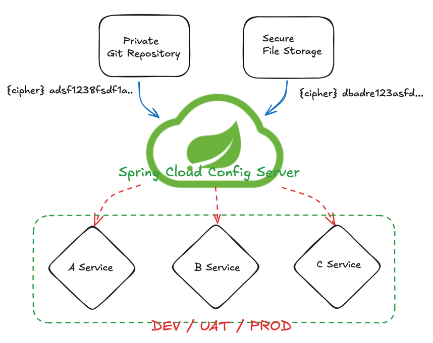

## Encryption

통신의 평문(원문)을 일정한 암호 시스템에 따라 암호문으로 바꾸는 일.  
사람이 알 수 없도록 변경하는 방법

### Encryption Types

- Symmetric Encryption (Shared), 대칭 암호화
  - Using the same key, 암호화 복호화 키가 같음
  - 대칭키를 사용할때는 private 한 공간에서 중요한 정보들을 저장한다. 예를들면, private git repository에 yml 정보를 암호화 하여 작성하는 방법이 있다.
- Asymmetric Encryption (RSA Keypair), 비대칭 암호화
  - Private and Public Key, 암호화 키와 복호화 키가 다름
  - 키를 생성하기 위한 java key tool 같은 key 저장소를 사용한다.
  
### Java Key tool
  
  - Using Java keytool
  - RSA
    - 공개키 암호화 시스템중에 하나
    - private, public 을 함께 사용하는 시스템
    - 암호화 뿐만 아니라 전자서명에도 사용되는 세계 최초의 알고리즘
  ```shell
# privateKey jks 파일 생성
$ > keytool -genkeypair -alias apiEncryptionKey -keyalg RSA -dname "CN=June, OU=API Development, O=None, L=Seoul, C=KR" -keypass "test1234" -keystore apiEncryptionKey.jks -storepass "test1234"

Generating 3,072 bit RSA key pair and self-signed certificate (SHA384withRSA) with a validity of 90 days
	for: CN=June, OU=API Development, O=None, L=Seoul, C=KR
	
# keytool 조회
$ > keytool -list -keystore apiEncryptionKey.jks -v

# publicKey 인증서 example
$ > keytool -export -alias apiEncryptionKey -keystore apiEncryptionkey.jks -rfc -file trustSerce
r.cer

# publicKey jks 파일 생성
$ > keytool -import -alias trustServer -file trustSercer.cer -keystore publicKey.jks
```

### Spring Cloud Config Server

