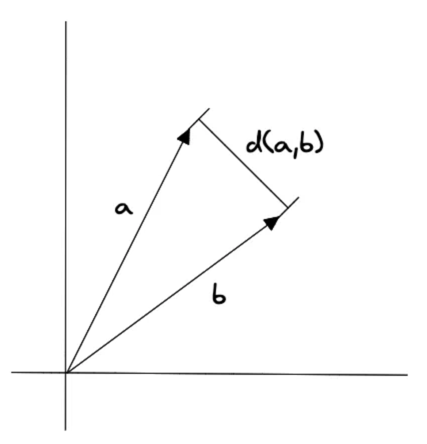
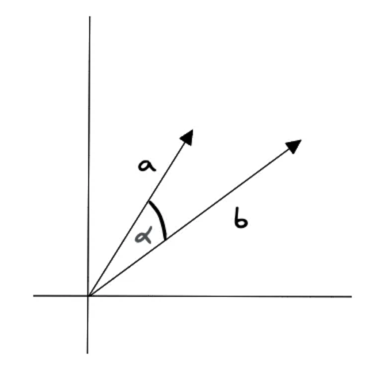

출처. Pinecone 홈페이지 : https://www.pinecone.io/learn/vector-similarity/
## Metric

### Euclidean distance


두 점사이의 거리를 비교해서 유사도를 알아내는 방법, 숫자가 작을 수록 유사도가 높은 것

### Dot product Similarity


```python
#e.g.
king = [1,2,3,4,5]
quenn = [3,5,1,2,3]

dot_product = king[0] * queen[0] * king[1] * queen[1] ...
```

곱한 값들을 더해서 유사도를 알아내는 방법, 숫자가 클 수록 유사도가 높다.

### Cosine Similarity



코사인 값구해서 각도 값으로 유사도를 알아내는 방법