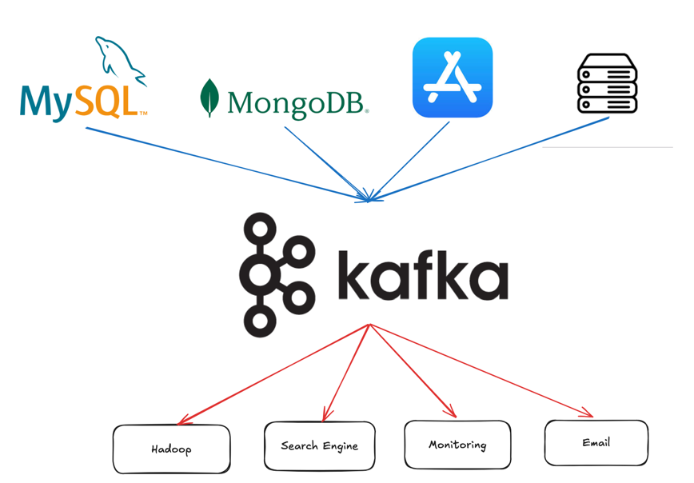
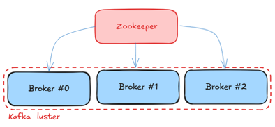

## Kafka

### Apache Kafka

- Apache Software Foundation 의 Scalar 언어로 된 오픈 소스 메세지 브로커 프로젝트
  - Open Source message Broker Project
  - 다양한 형태의 데이터를 보내는 쪽과 받는 쪽을 구분하는 원하는 방향으로 안전하게 데이터를 전달하는 기술
- 링크드인(Linked-in)에서 개발, 2011년 오픈 소스화
  - 2014년 11월 인크드인에서 Kafka를 개발하던 엔지니어들이 Kafka개발에 집중하기위해 Confluent라는 회사 창립
- 실시간 데이터 피드를 관리하기 위해 통일된 높은 처리량, 낮은 지연 시간을 지닌 플랫폼 제공

### Kafka 이전은?

- End-toEnd 연결 방식의 아키텍처
- 데이터 연동의 복잡성 증가
- 서로 다른 데이터 파이프라인 연결 구조
- 확장이 어려운 구조

### Kafka 이후는?

- Producer / Consumer 분리
- 메세지를 여러 Consumer 에게 허용
- 높은 처리량을 위한 메시지 최적화
- Scale-out 가능
- Eco-system



### Kafka Broker

- 실행 된 Kafka 애플리케이션 서버
- 3대 이상의 Broker Cluster 구성
- Zookeeper
  - 메타데이터(Broker ID, Controller ID 등) 저장
  - Controller 정보 저장
- n개 Broker 중 1대는 Controller 기능 수행
  - Controller 역할
    - 각 Broker 에게 담당 파티션 할당 수행
    - Broker 정상 동작 모니터링 관리



### kafka java library

- kafka-clients, kafka java library
- Producer, Consumer, Admin, Stream 등 Kafka 관련 API 제공


### Kafka 서버 기동

- Zookeeper 및 Kafka 서버 구동
```shell
$ > $KAFKA_HOME/bin/windows/zookeeper-server-start.sh $KAFKA_HOME/config/zookeeper.properties
$ > $KAFKA_HOME/bin/windows/kafka-server-start.sh $KAFKA_HOME/config/server.properties
```
- Topic 생성
```shell
$ > $KAFKA_HOME/bin/kafka-topics.sh --bootstrap-server localhost:9092 --create --topic quickstart-events --partitions 1
```
- Topic 목록 확인
```shell
$ > $KAFKA_HOME/bin/kafka-topic.sh --bootstrap-server locahost:9092 --list
```
- Topic 정보 확인
```shell
$ > $KAFKA_HOME/bin/kafka-topics.sh --bootstrap-server localhost:9092 --describe --topic quickstart-events
```
- 메세지 생산
```shell
$ > $KAFKA_HOME/bin/kafka-console-producer.sh --broker-list localhost:9092 --topic quickstart-events
> Hello, World!
> Hi, there
```
- 메세지 소비
```shell
$ > $KAFKA_HOME/bin/kafka-console-consumer.sh --bootstrap-server localhost:9092 --topic quickstart-events --from-beginning
```

### Kafka Connect

- 데이터를 자유롭게 Import/Export 할 수 있는 기능
- 코드 없이 Configuration 으로 데이터를 이동
- Standalone mode, Distribution mode 지원
  - RESTful API 통해 지원
  - Stream 또는 Batch 형태로 데이터 전송 가능
  - 커스텀 Connector를 통한 다양한 Plugin 제공(File, S3, Hive, MySql, etc ...)
- Source Connect
  - 원본 데이터를 Topic 에 넣어주는 역할
- Sink Connect
  - Topic 의 데이터가 업데이트되는 동시에 데이터를 받아 처리하는 역할