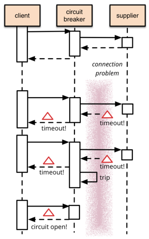

## CircuitBreaker

### CircuitBreaker?

- 장애가 발생하는 서비스에 반복적으로 호출하지 않도록 차단
- 특정 서비스가 정상적오르 동작하지 않을 경우 다른 기능으로 대체 -> 장애 회피
- https://martinfowler.com/bliki/CircuitBreaker.html
  - (요약)  
    Circuit Breaker 패턴은 소프트웨어 시스템에서 연속적인 장애를 방지하기 위한 기법  
    원격 호출이 실패할 때 시스템이 계속해서 실패하지 않도록 모니터링하고, 실패가 일정 수준을 넘으면 '차단기'를 동작시켜 더 이상의 요청을 차단  
    이 패턴은 장애 회복 후 다시 정상적인 동작을 시도하게 하며, 시스템 안정성을 상승  
    이를 통해 외부 서비스의 장애가 전체 시스템에 미치는 영향을 최소화


### Resilience4j

fault tolerance 기능 제공
- 에러가 발생하더라도 정상적인 서비스인 것처럼 동작하는 것 
기능
- resilience4j-circuitbreaker: Circuit breaking
- resilience4j-ratelimiter:Rate limiting
- resilience4j-bulkhead: Bulkheading
- resilience4j-retry: Automatic retrying (sync and async)
- resilience4j-timelimiter: Timeout handling
- resilience4j-cache: Result caching 
사이트
- https://resilience4j.readme.io/docs/getting-started
- https://github.com/resilience4j/resilience4j

### 사용

#### Spring Cloud 의 Circuit Breaker

https://spring.io/projects/spring-cloud-circuitbreaker

```groovy
implementation 'org.springframework.cloud:spring-cloud-circuitbreaker-resilience4j'
```

or  

https://resilience4j.readme.io/docs/getting-started

yml 파일에 설정을 하고 @CircuitBreaker 이라는 annotation으로 구현 가능