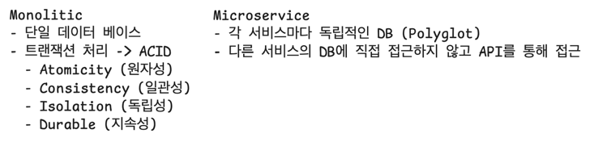
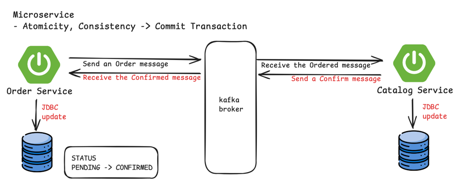
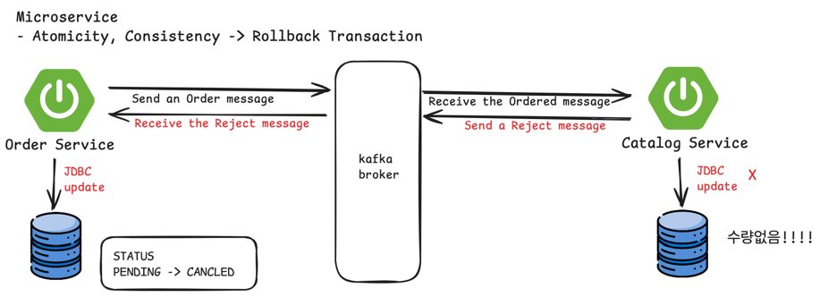
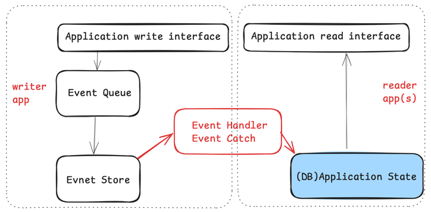

## EventDrivenArchitecture

### EventDrivenArchitecture?

MSA가 적용된 시스템을 보완하는 방법으로, 분산된 Application 서비스들이 이벤트를 기반으로 통신하고 서로의 동작을 야기하는 패턴이다.  
또는 이벤트의 생산, 감지, 소비 및 반응 또는 시스템 상태의 중대한 변화를 지원하는 소프트웨어 모델 또는 아키텍처의 패러다임이다.

#### EventDrivenArchitecture 트랜젝션 시나리오

### Event Sourcing

- 데이터의 마지막 상태만 저장하는 것이 아닌, 해당 데이터에 수행된 전체 이력을 기록  
- 데이터의 구조를 단순화 할 수 있고, INSERT만 존재하고 UPDATE는 존재하지 않음  
- 데이터의 일관성과 트랜잭션 처리 가능  
- 데이터 저장소의 개체를 직접 업데이트 하지 않기 때문에, 동시성에 대한 충돌문제 해결  

- 도메인 주도 설계 (Domain-Driven Design)
  - Aggregate, 데이터의 상태값을 바꿀 수 있는 방법
  - Projection, 현재 상태를 확인하는 방법
- 메시지 중심의 비동기 작업 처리
- 단점
  - 데이터가 마지막 상태를 갖기위한 모든 히스토리 데이터를 읽어야 하는데 이것을 보완하기 위한 방법으로
    - 모든 이벤트에 대한 복원 -> 스냅샷
    - 다양한 데이터 조회 -> CQRS

### CQRS (Command and Query Responsibility Segregation)

- Kafka가 가지고 있는 기본적인 메세지 전달 기능과 소비기능을 이용하여 CQRS 처리 가능
- 명령과 조회의 책임 분리
  - 상태를 변경하는 Command
  - 조회를 담당하는 Query

### Saga pattern

- Application 에서 Transaction 처리하기 위한 방법
  - Choreography, 이벤트를 서비스들끼리 주고 받음 
  - Orchestration, 이벤트를 중앙 집중식으로 통제함
- Application이 분리된 경우에는 가각의 Application은 자신만의 Local transaction 만 처리하면 된다는 개념
- 각 Application에 대한 작업이 하나로 끝나는 것이 아니라, 연쇄적인 반응으로 이루어진 트랜젝션일 경우 
  - 하나에서 문제가 생기면 **보상트랜젝션**이라는 것을 통해 다시 이전 상태로 만드는 것
  - 데이터의 원자성을 보장하지는 않지만 일관성은 보장