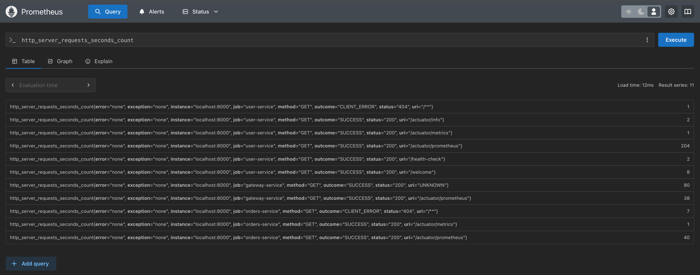
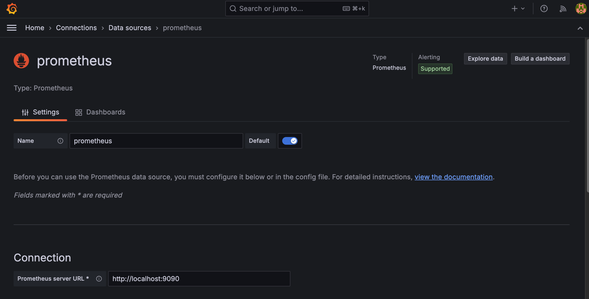

## Monitoring

시스템의 성능, 안정성, 보안성을 유지하고 향상시키기 위해 필수적인 요소

### Micrometer?

- https://micrometer.io/
- JVM 기반의 어플리케이션 Metrics 제공
- Spring Boot 2.0 이상부터는 기본적으로 Micrometer 를 포함하고 있음, Spring Boot Actuator와의 통합으로, 애플리케이션 메트릭을 쉽게 수집하고 노출가능
- Prometheus, Graphite, Datadog, New Relic, Elastic, CloudWatch 등 여러 메트릭 백엔드를 지원
- 짧은 지연 시간, 이벤트의 사용 빈도를 측정
- 시계열로 이벤트의 시간, 호출 빈도등을 측정
- @Timed

#### 용도

- 서버 상태 모니터링 (CPU 사용률, 메모리 사용률 등)
- HTTP 요청 메트릭 (요청 수, 응답 시간, 오류율 등)
- 사용자 정의 비즈니스 메트릭 (특정 이벤트 발생 수, 처리 시간 등)

#### 설치

- build.gradle
```groovy
implementation 'io.micrometer:micrometer-registry-prometheus'
```

- yml
```yml
management:
  endpoints:
    web:
      exposure:
        include: beans, prometheus, metrics
```

- config
```java
    @Bean
    public TimedAspect timedAspect(MeterRegistry registry) {
        return new TimedAspect(registry);
    }
```

### Prometheus

- https://prometheus.io/
- Metrics 를 수집하고 모니터링 및 알라에 사용되는 오픈소스
- 2016년부터 CNCF (Cloud Native Computing Foundation, 클라우드 네이티브 기술을 발전시키고 지원하는 비영리 단체) 에서 관리되는 공식 프로젝트
  - Level DB -> Time Series Database(TSDB)
- pulling 방식의 구조와 다양한 Metric Exporter 제공
- 시계열 DB 에 Metrics 저장, 조회(Query)
- 설정예시
  ```yml
  scrape_configs:
  # The job name is added as a label `job=<job_name>` to any timeseries scraped from this config.
  - job_name: "prometheus"

    # metrics_path defaults to '/metrics'
    # scheme defaults to 'http'.

    static_configs:
      - targets: ["localhost:9090"]

  - job_name: 'user-service'
    scrape_interval: 15s
    metrics_path: '/user-service/actuator/prometheus'
    static_configs:
      - targets: ['localhost:8000']
  - job_name: 'orders-service'
    scrape_interval: 15s
    metrics_path: '/orders-service/actuator/prometheus'
    static_configs:
      - targets: ['localhost:8000']
  - job_name: 'gateway-service'
    scrape_interval: 15s
    metrics_path: '/actuator/prometheus'
    static_configs:
    - targets: ['localhost:8000']
  ```
- 실행
  ```shell
  // http://localhost:9090
  $ > ./prometheus --config.file=prometheus.yml
  ```



### Grafana

- https://grafana.com/grafana/download?platform=mac
- 데이터 시각화, 모니터링 및 분석을 위한 오픈소스
- 시계열 데이터를 시각화하기 위한 대시보드 솔루션
- 실행
  ```shell
  // localhost:3000
  $ > ./bin/grafana-server
  ```
### Prometheus & Grafana 연동



- Connection 정보 입력


#### 대시보드

- https://grafana.com/grafana/dashboards/
- 
