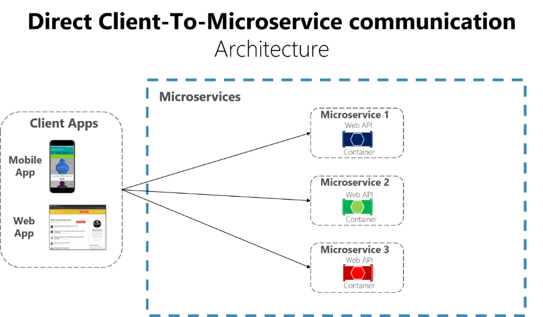
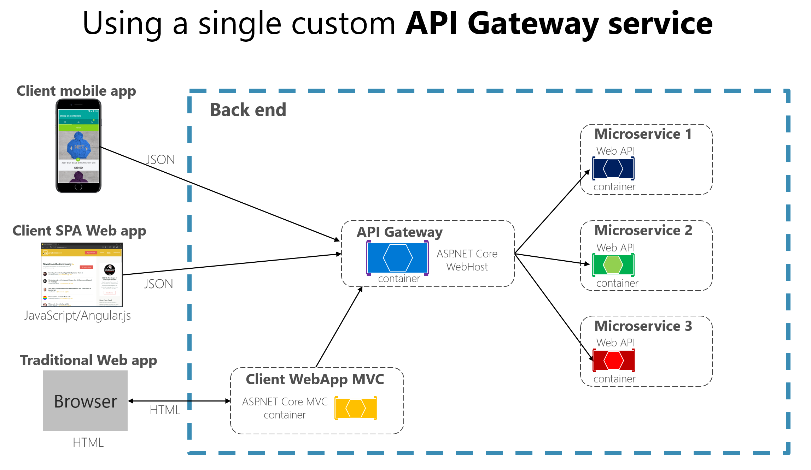
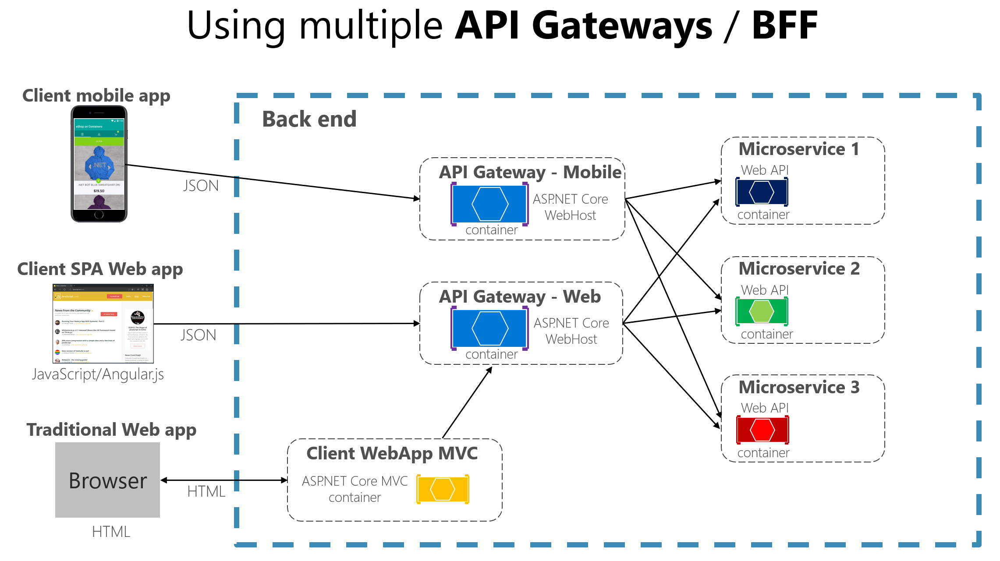
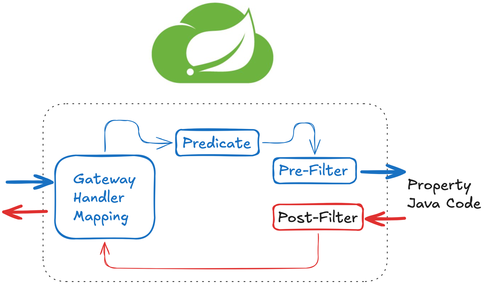

## Spring Cloud Gateway

### API Gateway Service?

사용자가 설정한 라우팅 설정에 따라서 각각 엔트포인트로 클라이언트를 대신해서 요청하고 응답을 받으면 다시 클라이언트에게 전달하는 Proxy 역할을 한다.  
시스템의 내부 구조는 숨기고 외부의 요청에 대해서 적절한 형태로 가공해서 응답할 수 있다는 장점을 가지고 있다.  
  
Azure API Gateway : https://learn.microsoft.com/ko-kr/dotnet/architecture/microservices/architect-microservice-container-applications/direct-client-to-microservice-communication-versus-the-api-gateway-pattern  
  

- 인증 및 권한부여
- 서비스(마이크로 서비스) 검색 통합
- 응답 캐싱
- 정책, 회로 차단기 및 QoS 다시 시도
- 속도 제한
- 부하 분산(로드밸런싱)
- 로깅, 추적, 상관 관계
- 헤더, 쿼리 문자열 및 청구 변환
- IP 허용 목록 관리

### Spring Cloud 에서의 MSA 간 통신
- Feign Client
- WebClient
- Ribbon
  - Client side Load Balancer(게이트웨이가 클라이언트에 있는 형태)
  - Health Check
  - Spring Cloud 에서 지원을 멈춤

### Spring Cloud Gateway - Filter

- 클라이언트로부터 어떤 요청 전달 받음 (Gateway, Handler, Mapping)
- 요청에 대한 사전 조건, 조건에 따라 분기 (Predicate)
- 사전 필터 (pre-filter) 와 사후 필터 (post-filter) 를 작성해서 요청정보 구성
  - 작성하는 방법 두 가지
    - Java Code
    - YAML 파일
- Custom Filter (사용자 정의 필터)
  - 로그 출력, 인증 처리, 로케일 변경 등등 사용자 정의 필터
  - 원하는 라우트 정보마다 개별적으로 설정이 가능
  - AbstractGatewayFilterFactory 상속받아 구현
    - apply() 메서드를 구현
- Global Filter
  - 공통 필터 개념

