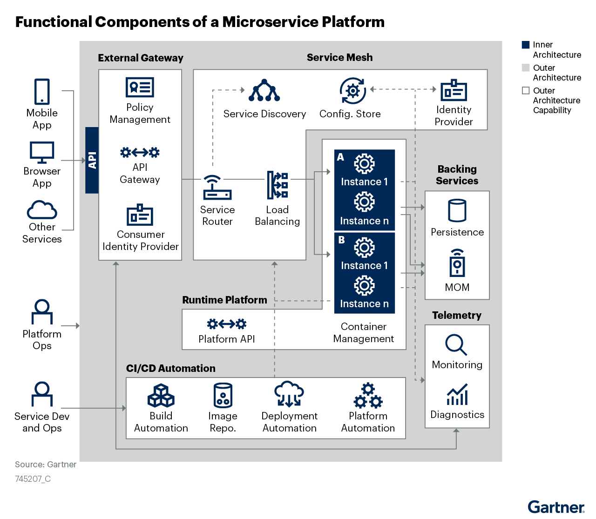

## MSA(Microservice Architecture)

### 특징

1. 기존 개발 방식과 패러다임을 상당수 바뀐다.
2. 독립적으로 배포가능한 작은 서비스로 구성된다.
3. 서비스 경계의 구분이 잘 되어야 한다.
4. 서로 상태에 대해 RESTful 하게 설계된다.
5. 환경설정정보는 외부 시스템을 활용해 관리한다.
6. 클라우드 기술을 최대한 활용한 기술이다.
7. 스케일 업, 스케일 다운에 동적이다.
8. 자동화 배포 관리 CI/CD 가 중요하다.
9. 시각화해서 관리할 수 있어야 한다.

### 도입하기 전에 생각해야 할 것들

1. 어느정도 변화를 받아들일 수 있을 것인가?
2. 독립 라이프 사이클, 서비스 경계가 잘 만들어져 있는가?
3. 독립적 화장성, 스케일링이 쉽게 되어 있는가?
4. 격리된 오류, 오류사항이 독립적인가?
5. 외부 종속성과의 상호작용의 단순화, 시스템이나 서비스간의 종속성을 최소화 하고, 응집력을 높일 수 있는 구조인가?
6. 여러가지 프로그래밍 언어 및 스토리지 기술들을 사용할 수 있는가?

### 마이크로 서비스의 구조

010 9216 1565

