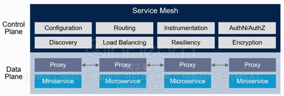
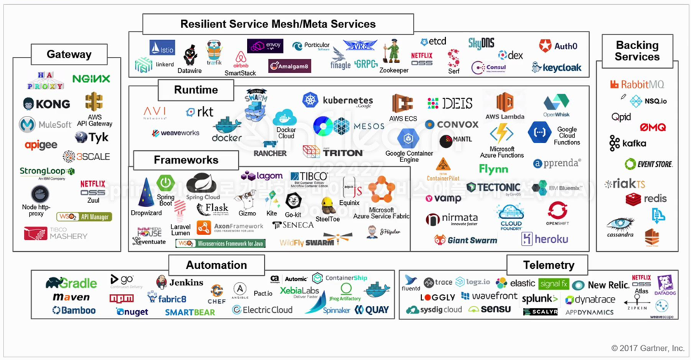
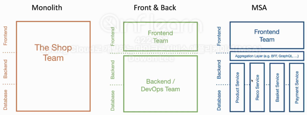
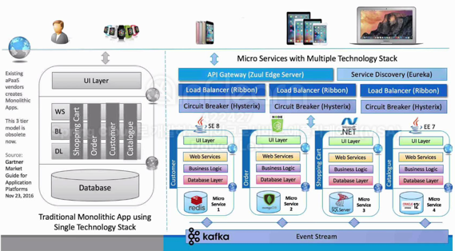
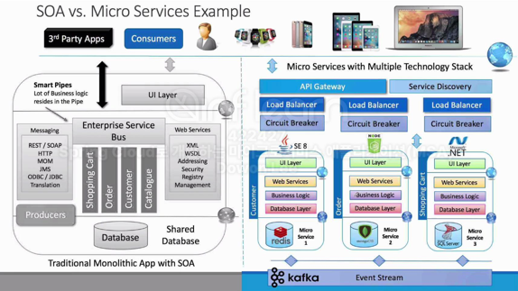

## MSA(Microservice Architecture)

### 특징

1. 기존 개발 방식과 패러다임을 상당수 바뀐다.
2. 독립적으로 배포가능한 작은 서비스로 구성된다.
3. 서비스 경계의 구분이 잘 되어야 한다.
4. 서로 상태에 대해 RESTful 하게 설계된다.
5. 환경설정정보는 외부 시스템을 활용해 관리한다.
6. 클라우드 기술을 최대한 활용한 기술이다.
7. 스케일 업, 스케일 다운에 동적이다.
8. 자동화 배포 관리 CI/CD 가 중요하다.
9. 시각화해서 관리할 수 있어야 한다.

### 도입하기 전에 생각해야 할 것들

1. 어느정도 변화를 받아들일 수 있을 것인가?
2. 독립 라이프 사이클, 서비스 경계가 잘 만들어져 있는가?
3. 독립적 화장성, 스케일링이 쉽게 되어 있는가?
4. 격리된 오류, 오류사항이 독립적인가?
5. 외부 종속성과의 상호작용의 단순화, 시스템이나 서비스간의 종속성을 최소화 하고, 응집력을 높일 수 있는 구조인가?
6. 여러가지 프로그래밍 언어 및 스토리지 기술들을 사용할 수 있는가?

### 마이크로 서비스의 구조

MSA의 표준은 없지만, 대표적으로 Linux 재단의 산하 CNCF(Cloud Native Computing Foundation)에서는 각 시스템과 시스템을 구성하고 있는 서비스별로 CNCF의 솔루션을 통한 구축을 가이드 함

#### Microservices Architecture Components

- 클라이언트  or 다른 마이크로 서비스들의 요청
- API
  - API Gateway라는 진입점을 통해 필요한 서비스를 요청
- Service Mesh
  - 서비스 라우터에게 어디로 가야할지 질문 
  - 필요한 마이크로 서비스가 어디에 저장되어 있는지 서비스 디스커버리의 등록 서비스에 물어봄
  - 어느 서비스로 갈지 검색하고 정해졌다면 
  - 분산형이라면 로드밸런스로 요청 또는 서비스에 직접 요청이 전달됨
  - 환경설정은 서비스를 통해서 외부 시스템에서 저장을 시켜서 사용하는 것이 일반적
- Runtime Platform
  - 마이크로 서비스는 컨테이너 가상화 기술을 통해서 구성이 되어 있음
- CI/CD Automation
  - 완성된 어플리케이션은 배포를 하기 위해서 CI-CD라는 오토메이션 기술을 사용
- Backing Service 
  - 마이크로 서비스에 저장되어 있는 다양한 스토리지
  - 메시징 처리 시스템을 통해서 서비스들간의 연결 가능
- Telemetry
  - 마이크로 서비스의 모니터링 기능과 진단 기능을 가짐

#### ServiceMesh

- 추상적인 개념이며, 마이크로스 서비스의 운영을 지원하는데 목적이 있다.
- 서비스 메시는 마이크로 서비스 아키텍처를 적용한 시스템의 내부 통신을 말한다.
- 서비스 메시를 통해서 서비스 간의 네트워크 로직을 추가함으로써 안정성, 신뢰성, 탄력성, 표준성, 가시성, 보완성 등을 확보할 수 있게 만들어주는 스트럭처 레이어이다.
- 서비스 메시는 URI 경로, 호스트 헤더, API 버전 또는 기타 응용 프로그램의 규칙을 기반으로 하는 네트워크 레이어이다.
- 서비스 메시에는 환경설정, 라우팅, 인증, 로드밸런싱, 서비스에 대한 검색, 암호화 등의 서비스를 통 마이크로 서비스의 개발과 운영을 지원한다.

#### CNCF (Cloud Native Computing Foundation)

Cloud Native Interactive Landscape : https://landscape.cncf.io/  
- 클라우드 네이티브를 구축함에 있어서 서로 인터렉티브하게 상호 연관될 수 있는 서비스들이 어떤 것이 있는지 볼 수 있다.
- 큰 네모칸으로 되어 있는 것들은 CNCF에서 가지고 있는 서비스이고, 나머지는 타사 제품이다.
- 이 곳에 있는 기술들을 각각 잘 조합하게 되면 서비스를 개발하는 것부터 운영하고 배포하고 모니터링까지 모든 것들을 조화롭게 쓸 수 있도록 하는 가이드이다.

### Monolithic vs. MSA

- 모노리스 방식
  - 어플리케이션을 개발함에 있어서 필요한 모든 요소를 하나의 커다란 소프트웨어 안에서 전부 포함시켜 개발하는 방법
  - 데이터베이스 로직, 비즈니스 로직, 화면을 처리하는 프론트앤드 기술까지 하나의 어플리케이션에서 의존선을 가지고 패키지 된 형태
- 마이크로 서비스 방식
  - 어플리케이션을 구성하는 각각의 구성 요소 및 서비스의 내용을 분리해서 개발하고 운영하는 방식
  - 분리된 서비스가 다른 서비스에 영향을 주지 않거나 최소화 하면서 독립적으로 배포가 가능한 형태
  - 어플리케이션 전체가 다운되는 일은 없는 형태

### SOA vs. MSA Example

