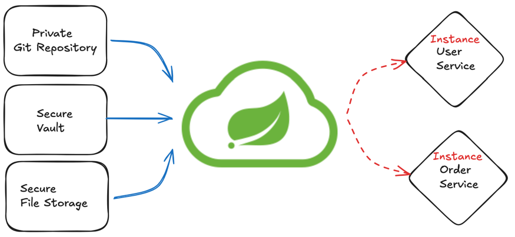

## Spring Cloud Config

### Spring Cloud Config?

- 분산시스템에서 서버, 클라이언트 구성에 필요한 설정 정보를 외부 시스템에서 관리
- 하나의 중앙화 된 저장소에서 구성요소 관리 기능
- 각 서비스를 다시 빌드하지 않고, 바로 적용 간으
- 애플리케이션 배포 파이프라인을 통해 환경에 맞는 구성 정보 사용

                                                                                                                                                                                                                                                                                                      